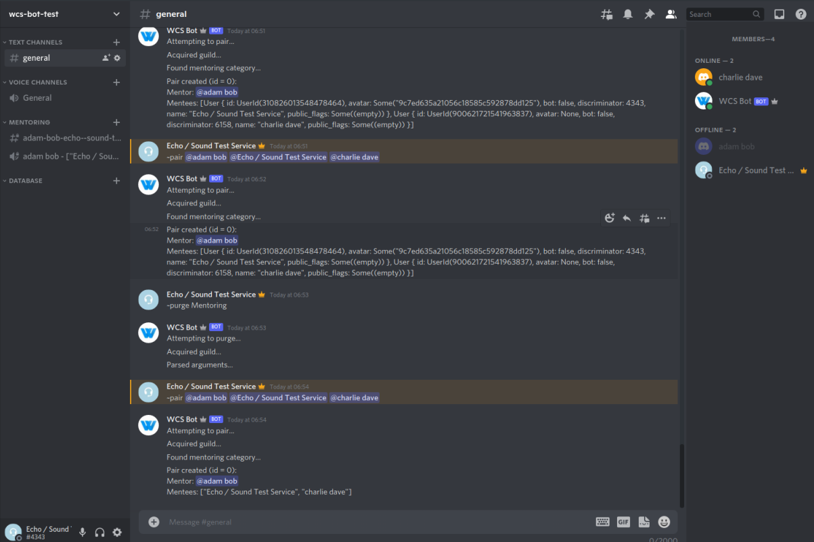

# Warwick Coding Society Bot

Automates management of society members and activities.
(Work in progress, more features pending.)

## Compilation

To compile, install Rust and run  
`cargo build`

## Adding to server

[Use this link](https://discord.com/oauth2/authorize?client_id=900550898089074688&scope=bot&permissions=8)

## Running

Export the bot token to an environment variable named `DISCORD_TOKEN`:  
`$ export DISCORD_TOKEN=[token]`  
and run:  
`cargo run`
